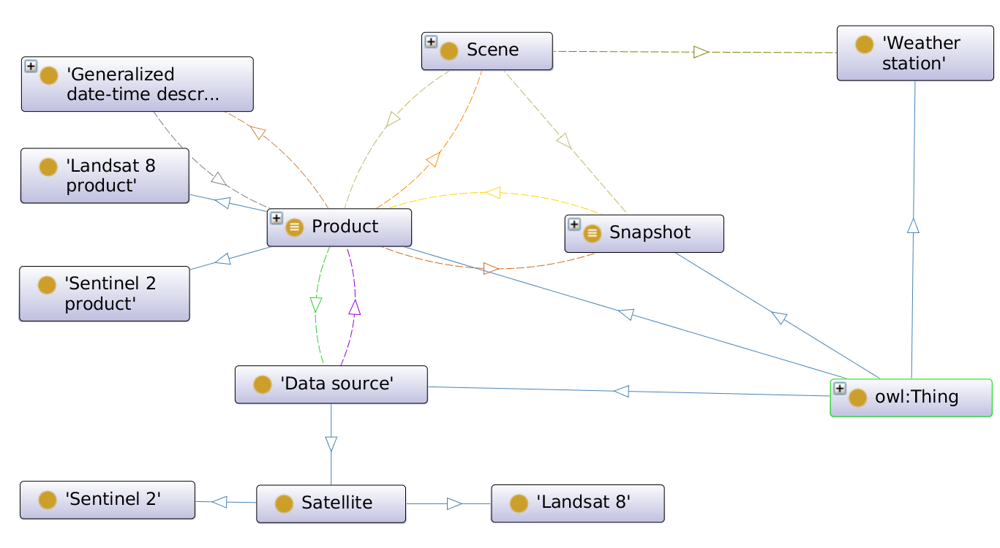

# RESEO: Remote Sensing Ontology

Earth Observation (EO) based on Remote Sensing (RS) is gaining importance nowadays, since it offers a well-grounded technological framework for the development of advanced applications in multiple domains, such as climate change, precision agriculture, smart urbanism, safety, and many others. This promotes the continuous generation of data-driven software facilities oriented to advanced processing, analysis and visualization, which often offer enhanced computing capabilities. Nevertheless, the development of knowledge-driven approaches is still an open challenge in remote sensing, besides they provide human experts with domain knowledge representation, support for data standardization and semantic integration of sources, which indeed enhance the construction of advanced on-top applications. To this end, the use of ontologies and web semantic technologies have shown high success in knowledge representation in many fields, in which the Earth Observation is not an exception. However, as argued by the research community, there is large room for improvement in the specific case of remote sensing, where ontologies that consider the special nature and structure of different satellital and airborne data products are demanded. This article addresses, in first instance, part of this need by proposing a semantic model for the consolidation, integration, reasoning and linking of data (and meta-data), in the context of satellital remote sensing products for EO. With this objective, an OWL ontology has been developed and an RDF repository has been generated to allow advanced SPARQL querying. Although the proposal has been designed to consider remote sensing data products in general, the current study is mainly focused on the Sentinel 2 satellite mission from the Copernicus Programme of the European Space Agency (ESA). Four different use cases are showcased to check potentials of the proposed semantic model in terms of ontology integration, federated querying, data analysis and reasoning.

# Summary of features

1. Ontology to cover multiple kinds of data product of multi/hyper-spectral images and meta-data from well-known satellites on Earth Observation programs, UAVs, etc.
2. RESEO.owl has been linked with related external ontologies (OBOE, SNN, TIME-OWL, AEMET, GeoSPARQL) to obtain a enriched knowledge framework.
3. RESEO.owl includes a series of SWRL rules for the pixel classification in Sentinel 2 products.

# Access to knowledge graph
Some query examples and access to the SPARQL endpoint of RESEO can be found at [https://opendata.khaos.uma.es/dataset/reseo](https://opendata.khaos.uma.es/dataset/reseo).

## Class diagram

